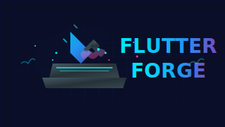

  
  <h1 align="center">NonStop</h1>
  
Digital Product Development Experts for Startups & Enterprises

  

    <a href="https://nonstopio.com/about-us">About</a> |
    <a href="https://nonstopio.com">Website</a>
  

  

<!-- ALL-CONTRIBUTORS-BADGE:START - Do not remove or modify this section -->

<!-- ALL-CONTRIBUTORS-BADGE:END -->

A place where Flutter packages are crafted and built.

- All shared [packages](packages/README.md) are in the `/packages` directory
- All [plugins](plugins/README.md) are in the `/plugins` directory

| Packages                                                                                                                                                                                            |
|:----------------------------------------------------------------------------------------------------------------------------------------------------------------------------------------------------|
|                                      |
|                                                  |
|                                  |
|  |
|              |
|                                                  |
|      |
|                                                                  |
|                          |
|                                              |  

| Plugins                                                                                                                                                                                     |
|:--------------------------------------------------------------------------------------------------------------------------------------------------------------------------------------------|
|  |

---

## 🔗 Connect with NonStop

**Stay connected and get the latest updates!**

---

>  ⭐ Star us on [GitHub](https://github.com/nonstopio/flutter_forge) if this helped you!

## Analytics

## Contributors

<!-- ALL-CONTRIBUTORS-LIST:START - Do not remove or modify this section -->
<!-- prettier-ignore-start -->
<!-- markdownlint-disable -->
<table>
  <tbody>
    <tr>
      <td align="center" valign="top" width="14.28%"><a href="https://github.com/ProjectAJ14"> <b>Ajay Kumar</b></a> <a href="https://github.com/nonstopio/flutter_forge/commits?author=ProjectAJ14" title="Code">💻</a> <a href="#content-ProjectAJ14" title="Content">🖋</a> <a href="https://github.com/nonstopio/flutter_forge/commits?author=ProjectAJ14" title="Documentation">📖</a> <a href="#example-ProjectAJ14" title="Examples">💡</a> <a href="#maintenance-ProjectAJ14" title="Maintenance">🚧</a></td>
      <td align="center" valign="top" width="14.28%"><a href="https://github.com/rajan-nonstopio"> <b>rajan-nonstopio</b></a> <a href="https://github.com/nonstopio/flutter_forge/commits?author=rajan-nonstopio" title="Code">💻</a></td>
    </tr>
  </tbody>
  <tfoot>
    <tr>
      <td align="center" size="13px" colspan="7">
        
          <a href="https://all-contributors.js.org/docs/en/bot/usage">Add your contributions</a>
        </img>
      </td>
    </tr>
  </tfoot>
</table>

<!-- markdownlint-restore -->
<!-- prettier-ignore-end -->

<!-- ALL-CONTRIBUTORS-LIST:END -->
