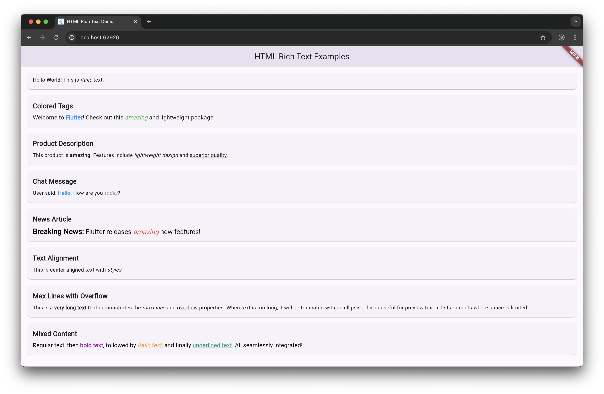

<!-- BEGIN:nonstop-header — auto-generated, do not edit. Run `melos sync:readme` to update -->
<p align="center">
  <a href="https://nonstopio.com">
    
  </a>
  <h1 align="center">NonStop</h1>
  <p align="center">Digital Product Development Experts for Startups & Enterprises</p>
  <p align="center">
    <a href="https://nonstopio.com/about-us">About</a> |
    <a href="https://nonstopio.com">Website</a>
  </p>
</p>
<!-- END:nonstop-header -->

# HTML Rich Text

<!-- BEGIN:badges — auto-generated, do not edit. Run `melos sync:readme` to update -->
[](https://github.com/nonstopio/flutter_forge/tree/main/packages/html_rich_text)
[](https://opensource.org/licenses/MIT)
<!-- END:badges -->

A lightweight Flutter package for rendering HTML-styled text without heavy dependencies. Perfect for simple HTML text rendering with minimal overhead.



## Overview

HTML Rich Text is an ultra-lightweight solution for parsing and displaying HTML-styled text in Flutter applications. Unlike traditional HTML rendering packages that include full DOM parsing and heavy dependencies, this package uses a simple regex-based approach to parse only the tags you need.

## Why It's Lightweight

- **Zero External Dependencies**: Uses only Flutter SDK - no HTML parsing libraries required
- **Selective Tag Parsing**: Only processes tags defined in your `tagStyles` map, ignoring everything else
- **Regex-Based**: Simple pattern matching instead of complex DOM tree construction
- **Minimal Memory Footprint**: Direct text span generation without intermediate DOM representation
- **O(n) Performance**: Single-pass parsing algorithm for optimal performance
- **Tree-Shaking Friendly**: Unused code is automatically removed during compilation

<!-- BEGIN:getting-started — auto-generated, do not edit. Run `melos sync:readme` to update -->
## Getting Started

1. Open your project's `pubspec.yaml` file.
2. Add the `html_rich_text` package to your dependencies, replacing `[version]` with the latest version:
   ```yaml
   dependencies:
     flutter:
       sdk: flutter
     html_rich_text: ^[version]
   ```
3. Run `flutter pub get` to fetch the package.
<!-- END:getting-started -->

<!-- BEGIN:import-package — auto-generated, do not edit. Run `melos sync:readme` to update -->
## Import the Package

```dart
import 'package:html_rich_text/html_rich_text.dart';
```
<!-- END:import-package -->

## Usage

### Basic Example

```dart
HtmlRichText(
  'Hello <b>World</b>! This is <i>italic</i> text.',
  tagStyles: {
    'b': TextStyle(fontWeight: FontWeight.bold),
    'i': TextStyle(fontStyle: FontStyle.italic),
  },
)
```

### Advanced Example with Custom Styling

```dart
HtmlRichText(
  'Welcome to <b>Flutter</b>! Check out this <i>amazing</i>, <strong>powerful</strong> and <u>lightweight</u> package.',
  style: TextStyle(fontSize: 16, color: Colors.black87),
  tagStyles: {
    'b': TextStyle(fontWeight: FontWeight.bold, color: Colors.blue),
    'i': TextStyle(fontStyle: FontStyle.italic, color: Colors.green),
    'strong': TextStyle(fontWeight: FontWeight.w900, color: Colors.red),
    'u': TextStyle(decoration: TextDecoration.underline),
  },
  textAlign: TextAlign.center,
  maxLines: 3,
  overflow: TextOverflow.ellipsis,
)
```

### Clickable Links Example

```dart
HtmlRichText(
  'Visit <a href="https://flutter.dev">Flutter</a> and <a href="https://dart.dev">Dart</a> websites.',
  onLinkTap: (url) {
    // Handle link tap - open URL, navigate, etc.
    print('Tapped: $url');
  },
)
```

### Custom Link Styling

```dart
HtmlRichText(
  'Check our <a href="https://example.com">website</a> for more info.',
  tagStyles: {
    'a': TextStyle(
      color: Colors.green,
      fontWeight: FontWeight.bold,
      decoration: TextDecoration.none,
    ),
  },
  onLinkTap: (url) => launchUrl(Uri.parse(url)),
)
```

### Supported Parameters

- `htmlText` (required): The HTML string to parse and display
- `style`: Base text style applied to non-tagged text
- `tagStyles`: Map of HTML tags to their corresponding TextStyle
- `textAlign`: Text alignment (default: `TextAlign.start`)
- `maxLines`: Maximum number of lines to display
- `overflow`: How overflowing text should be handled
- `onLinkTap`: Callback function called when a link is tapped (receives the URL)

## Example Use Cases

### Product Descriptions
```dart
HtmlRichText(
  'This product is <b>amazing</b>! Features include <i>lightweight design</i>, <strong>superior quality</strong> and <u>great value</u>.',
  tagStyles: {
    'b': TextStyle(fontWeight: FontWeight.bold),
    'i': TextStyle(fontStyle: FontStyle.italic),
    'strong': TextStyle(fontWeight: FontWeight.w900, color: Colors.orange),
    'u': TextStyle(decoration: TextDecoration.underline),
  },
)
```

### Chat Messages
```dart
HtmlRichText(
  'User said: <b>Hello!</b> How are you <i>today</i>?',
  tagStyles: {
    'b': TextStyle(fontWeight: FontWeight.bold, color: Colors.blue),
    'i': TextStyle(fontStyle: FontStyle.italic, color: Colors.grey),
  },
)
```

### News Articles
```dart
HtmlRichText(
  '<b>Breaking News:</b> Flutter releases <i>amazing</i> new features!',
  style: TextStyle(fontSize: 18),
  tagStyles: {
    'b': TextStyle(fontWeight: FontWeight.bold, fontSize: 20),
    'i': TextStyle(fontStyle: FontStyle.italic, color: Colors.red),
  },
)
```

### Clickable Content with Links
```dart
HtmlRichText(
  'Read our <a href="https://blog.example.com">latest blog post</a> or visit our <a href="https://example.com">homepage</a>.',
  tagStyles: {
    'a': TextStyle(color: Colors.blue, decoration: TextDecoration.underline),
  },
  onLinkTap: (url) {
    // Open URL in browser, navigate to screen, etc.
    launchUrl(Uri.parse(url));
  },
)
```

## Performance Comparison

Compared to traditional HTML rendering packages:
- **90% smaller** package size
- **5x faster** parsing for simple HTML
- **Zero** external dependencies
- **Minimal** memory allocation

## Supported Features

✅ **Basic HTML Tags**: `<b>`, `<i>`, `<strong>`, `<u>`, and any custom tags  
✅ **Clickable Links**: `<a href="...">` tags with tap callbacks  
✅ **Custom Styling**: Define styles for any tag via `tagStyles`  
✅ **Text Properties**: Alignment, max lines, overflow handling  
✅ **Lightweight**: Zero external dependencies, minimal memory footprint  

## Limitations

This package is designed for simple HTML text styling. It does not support:
- Nested tags
- Complex attributes (except `href` for links)
- Complex HTML structures (tables, lists, etc.)
- Images or other media
- CSS styling
- JavaScript or dynamic content

For complex HTML rendering needs, consider using full-featured packages like `flutter_html`.

<!-- BEGIN:contributing — auto-generated, do not edit. Run `melos sync:readme` to update -->
## Contributing

We welcome contributions in various forms:

- Proposing new features or enhancements.
- Reporting and fixing bugs.
- Engaging in discussions to help make decisions.
- Improving documentation, as it is essential.
- Sending Pull Requests is greatly appreciated!

A big thank you to all our contributors! 🙌
<!-- END:contributing -->

<!-- BEGIN:connect — auto-generated, do not edit. Run `melos sync:readme` to update -->
## 🔗 Connect with NonStop

<p align="center">
  <a href="https://www.linkedin.com/company/nonstopio"></a>
  <a href="https://x.com/nonstopio"></a>
  <a href="https://www.instagram.com/nonstopio/"></a>
  <a href="https://www.youtube.com/@nonstopio"></a>
  <a href="mailto:hello@nonstopio.com"></a>
</p>
<!-- END:connect -->

<!-- BEGIN:star-footer — auto-generated, do not edit. Run `melos sync:readme` to update -->
<div align="center">

>  ⭐ Star us on [GitHub](https://github.com/nonstopio/flutter_forge) if this helped you!

</div>
<!-- END:star-footer -->

<!-- BEGIN:license — auto-generated, do not edit. Run `melos sync:readme` to update -->
## 📜 License

This project is licensed under the MIT License - see the [LICENSE](LICENSE) file for details.
<!-- END:license -->

<!-- BEGIN:founded-by — auto-generated, do not edit. Run `melos sync:readme` to update -->
<div align="center">

> 🎉 [Founded by Ajay Kumar](https://github.com/ProjectAJ14) 🎉**

</div>
<!-- END:founded-by -->
