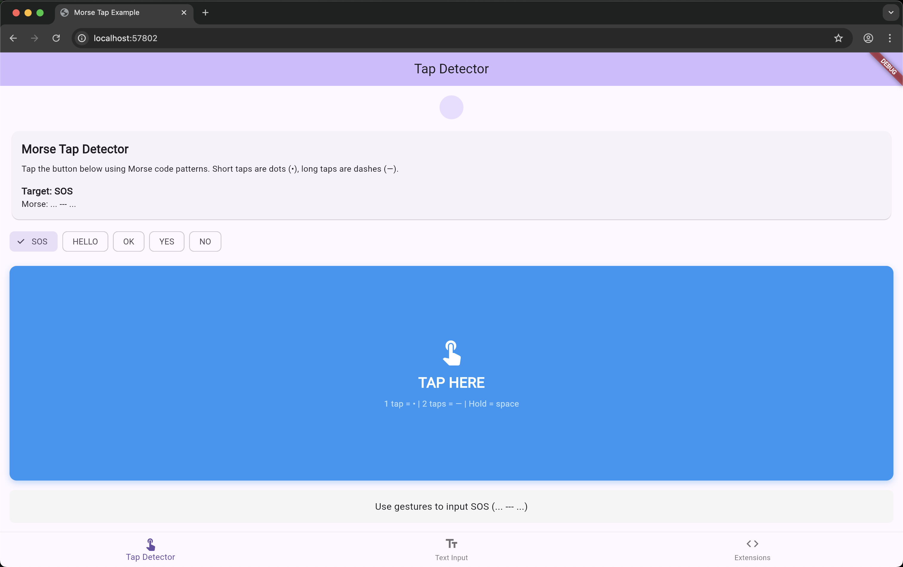

<p align="center">
  <a href="https://nonstopio.com">
    
  </a>
  <h1 align="center">NonStop</h1>
  <p align="center">Digital Product Development Experts for Startups & Enterprises</p>
  <p align="center">
    <a href="https://nonstopio.com/about-us">About</a> |
    <a href="https://nonstopio.com">Website</a>
  </p>
</p>

# morse_tap

[](https://github.com/nonstopio/flutter_forge/tree/main/packages/morse_tap)
[](https://opensource.org/licenses/MIT)

A Flutter package that provides Morse code input functionality using intuitive gestures. Create interactive Morse code experiences with single taps for dots, double taps for dashes, and long presses for spaces.



## Features

✨ **MorseTapDetector** - Widget that detects specific Morse code patterns using gestures  
🎯 **MorseTextInput** - Real-time gesture-to-text conversion widget  
🔄 **String Extensions** - Convert any string to/from Morse code  
⚡ **Fast Algorithm** - Efficient Morse code conversion with comprehensive character support  
🎨 **Intuitive Gestures** - Single tap = dot, double tap = dash, long press = space  
📳 **Haptic Feedback** - Customizable tactile feedback for enhanced user experience

## Usage Examples

### 1. MorseTapDetector - Pattern Detection

Detect when users input a specific Morse code pattern using gestures:

```dart
MorseTapDetector(
  expectedMorseCode: "... --- ...", // SOS pattern
  onCorrectSequence: () {
    print("SOS detected!");
    // Handle correct sequence
  },
  onIncorrectSequence: () {
    print("Wrong pattern, try again");
  },
  onSequenceChange: (sequence) {
    print("Current sequence: $sequence");
    // Update UI with current input
  },
  onDotAdded: () => print("Dot added"),
  onDashAdded: () => print("Dash added"),
  onSpaceAdded: () => print("Space added"),
  child: Container(
    width: 200,
    height: 200,
    decoration: BoxDecoration(
      color: Colors.blue,
      borderRadius: BorderRadius.circular(12),
    ),
    child: const Center(
      child: Text(
        'Use Gestures for SOS',
        style: TextStyle(color: Colors.white, fontSize: 20),
      ),
    ),
  ),
)
```

### 2. MorseTextInput - Real-time Conversion

Convert tap input to text in real-time:

```dart
class MorseInputExample extends StatelessWidget {
  final TextEditingController controller = TextEditingController();

  @override
  Widget build(BuildContext context) {
    return Column(
      children: [
        MorseTextInput(
          controller: controller,
          autoConvertToText: true,
          showMorsePreview: true,
          onTextChanged: (text) {
            print("Converted text: $text");
          },
          decoration: const InputDecoration(
            labelText: 'Tap to input text',
            border: OutlineInputBorder(),
          ),
        ),
        // Your converted text appears in the controller
        TextField(
          controller: controller,
          readOnly: true,
          decoration: const InputDecoration(
            labelText: 'Output',
          ),
        ),
      ],
    );
  }
}
```

### 3. String Extensions

Easy string to Morse code conversion:

```dart
// Convert text to Morse code
String morse = "HELLO WORLD".toMorseCode();
print(morse); // ".... . .-.. .-.. --- / .-- --- .-. .-.. -.."

// Convert Morse code back to text
String text = "... --- ...".fromMorseCode();
print(text); // "SOS"

// Validate Morse input
bool isValid = "... --- ...".isValidMorseSequence();
print(isValid); // true

// Check if string contains only Morse characters
bool isMorseInput = "... abc".isValidMorseInput();
print(isMorseInput); // false
```

## Configuration

### Timing Configuration

Customize the input timeout:

```dart
MorseTapDetector(
  expectedMorseCode: "... --- ...",
  inputTimeout: Duration(seconds: 5),  // Time allowed for next input
  onCorrectSequence: () => print("Correct!"),
  child: MyButton(),
)
```

Note: The timeout resets after each input, allowing users to take their time
with long sequences as long as they keep entering characters.

### Haptic Feedback

Provide tactile feedback for gestures:

```dart
MorseTapDetector(
  expectedMorseCode: "... --- ...",
  hapticConfig: HapticConfig.defaultConfig,  // Enable haptic feedback
  onCorrectSequence: () => print("Correct!"),
  child: MyButton(),
)
```

**Preset configurations:**
```dart
// Different preset options
HapticConfig.disabled       // No haptic feedback
HapticConfig.light          // Subtle feedback
HapticConfig.defaultConfig  // Moderate feedback  
HapticConfig.strong         // Intense feedback

// Custom configuration
HapticConfig(
  enabled: true,
  dotIntensity: HapticFeedbackType.lightImpact,
  dashIntensity: HapticFeedbackType.mediumImpact,
  correctSequenceIntensity: HapticFeedbackType.heavyImpact,
)
```

### Visual Feedback

Control visual feedback options:

```dart
MorseTextInput(
  controller: controller,
  showMorsePreview: true,              // Show Morse preview
  feedbackColor: Colors.green,         // Tap feedback color
  tapAreaHeight: 150.0,               // Height of tap area
  autoConvertToText: false,           // Keep as Morse code
)
```

## Supported Characters

The package supports:
- **Letters**: A-Z (26 letters)
- **Numbers**: 0-9 (10 digits)  
- **Punctuation**: . , ? ' ! / ( ) & : ; = + - _ " $ @

*See the complete mapping in `MorseCodec` class documentation.*

## Advanced Usage

### Custom Morse Patterns

Create custom pattern detection:

```dart
final customPattern = "HELP".toMorseCode();

MorseTapDetector(
  expectedMorseCode: customPattern,
  onCorrectSequence: () => showDialog(
    context: context,
    builder: (context) => AlertDialog(
      title: Text("Help Requested!"),
      content: Text("Someone needs assistance."),
    ),
  ),
  child: EmergencyButton(),
)
```

## Contributing

We welcome contributions in various forms:

- Proposing new features or enhancements.
- Reporting and fixing bugs.
- Engaging in discussions to help make decisions.
- Improving documentation, as it is essential.
- Sending Pull Requests is greatly appreciated!

---


<div align="center">

**Stay connected and get the latest updates!**

[](https://www.linkedin.com/company/nonstop-io)
[](https://x.com/NonStopio)
[](https://www.instagram.com/nonstopio_technologies/)
[](https://www.youtube.com/@NonStopioTechnology)
[](mailto:contact@nonstopio.com)

</div>

---

<div align="center">

  ⭐ Star us on [GitHub](https://github.com/nonstopio/flutter_forge) if this helped you!

</div>

## 📜 License

This project is licensed under the MIT License - see the [LICENSE](LICENSE) file for details.

<div align="center">

 🎉 [Founded by Ajay Kumar](https://github.com/ProjectAJ14) 🎉**

</div>
