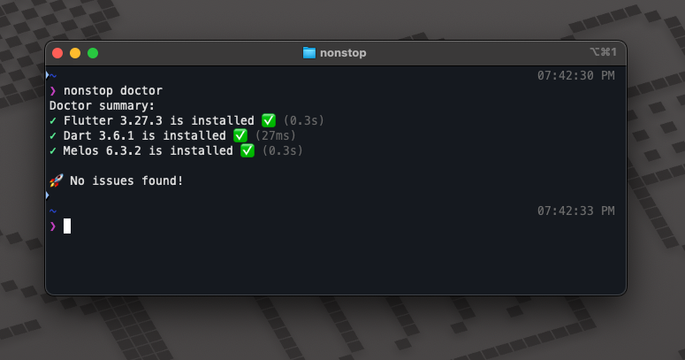
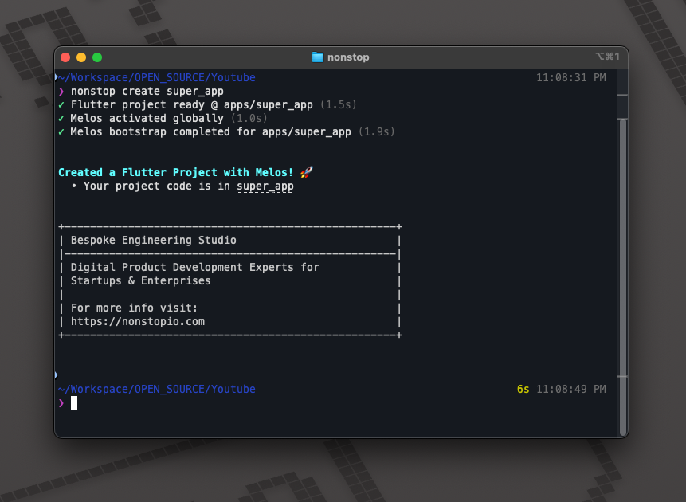

<p align="center">
  <a href="https://nonstopio.com">
    
  </a>
  <h1 align="center">NonStop</h1>
  <p align="center">Digital Product Development Experts for Startups & Enterprises</p>
  <p align="center">
    <a href="https://nonstopio.com/about">About</a> |
    <a href="https://nonstopio.com">Website</a>
  </p>
</p>

# nonstop_cli

[](https://pub.dev/packages/nonstop_cli)

A command-line interface for the Flutter to generate Flutter projects from
predefined templates.

# Quick Start 🚀

## Installing 🧑‍💻

```sh
dart pub global activate nonstop_cli
```

Or install a [specific version](https://pub.dev/packages/nonstop_cli/versions)
using:

```sh
dart pub global activate nonstop_cli <version>
```

> If you haven't already, you might need to
> [set up your path](https://dart.dev/tools/pub/cmd/pub-global#running-a-script-from-your-path).

When that is not possible (eg: CI environments), run `nonstop` commands via:

```sh
dart pub global run nonstop_cli:nonstop <command> <args>
```

# Commands ✨

## `nonstop doctor`

Nonstop Doctor is a command-line tool that helps developers set up and troubleshoot
their Flutter development environment.

- Ensure that the required software is installed
- Diagnose issues and provide recommendations

```sh
nonstop doctor
```




## Usage

### Create project `nonstop create`

Create a Flutter project in seconds based on the predefined template.


```sh
nonstop create <project-name> [arguments]
```



> The below structure will be created for mono repo setup.

```
super_app
    ├── apps
    │    └── super_app
    ├── features
    ├── packages
    ├── plugins
    ├── analysis_options.yaml
    ├── README.md
    ├── melos.yaml
    └── pubspec.yaml
```


```sh
Create a new Flutter project within a Melos-managed mono-repo

Usage: nonstop create <project-name> [arguments]
-h, --help                    Print this usage information.
    --application-id          The bundle identifier on iOS or application id on Android. (defaults to <org-name>.<project-name>)
-o, --output-directory        The desired output directory when creating a new project.
    --description             The description for this new project.
                              (defaults to "A Melos-managed project for mono-repo, created using NonStop CLI.")
    --org-name                The organization for this new project.
                              (defaults to "com.example")
-t, --template                Specify the type of project to create.

          [mono] (default)    (default) Generate a Flutter application along with mono-repo.
          [package]           Generate a shareable Flutter project containing modular Dart code.

Run "nonstop help" to see global options.
```

## Contact

Follow us, stay up to date or reach out on:

- [LinkedIn](https://www.linkedin.com/company/nonstop-io)
- [X.com](https://x.com/NonStopio)
- [Instagram](https://www.instagram.com/nonstopio_technologies/)
- [YouTube](https://www.youtube.com/@NonStopioTechnology)
- [Email](mailto:contact@nonstopio.com)

---


<p align="center">Made with ❤️ by <a href="https://github.com/ProjectAJ14">Ajay Kumar</a></p>

